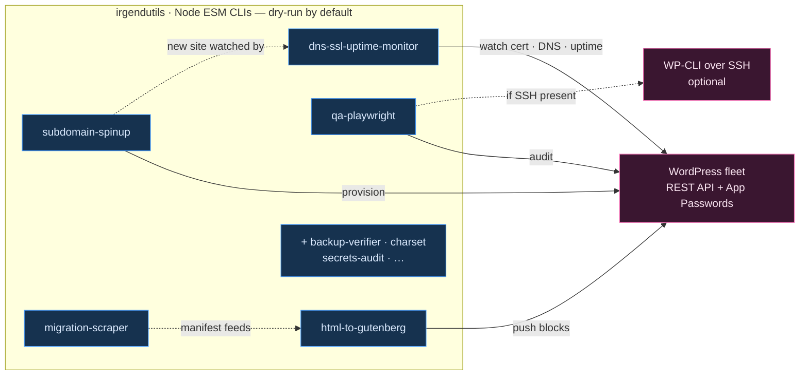

# Architecture: irgendutils — Fleet System Overview

> **TL;DR:** Monorepo of single-purpose Node ESM CLIs that provision, QA, migrate, and monitor a WordPress site fleet. Default access path is the WP REST API + Application Passwords; idempotent and dry-run by default. Some utils feed each other.

## The shape

## Scope & surface
- **Access path:** WP REST API + **Application Passwords** by default; WP-CLI over SSH is an optional optimization (detect at startup, degrade gracefully).
- **Blast radius = the whole fleet** — every util acts on production WordPress sites. Mitigated by: idempotent, reversible, **dry-run by default** (`--apply` to mutate; teardown for every create).
- Secrets from env, never committed (`.env.example` in every app). "Verify, don't assume" — each app ships a verification step.
- Inter-app flow: `migration-scraper` → `html-to-gutenberg`; `subdomain-spinup` → monitored by `dns-ssl-uptime-monitor`.

## Where things live
Each sub-app has its **own `CLAUDE.md`** (the authoritative module-level spec). See the monorepo `CLAUDE.md` for the roster and token-cost working agreement.

## Related
- [[00-Index/Home]]
